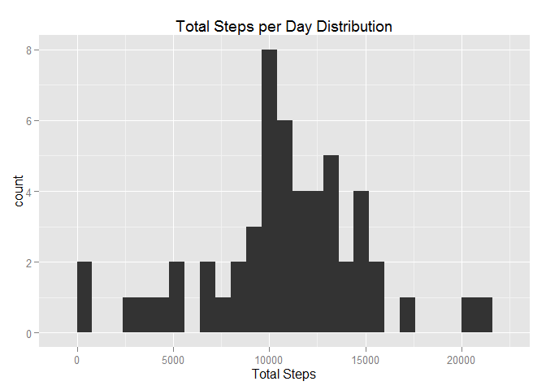
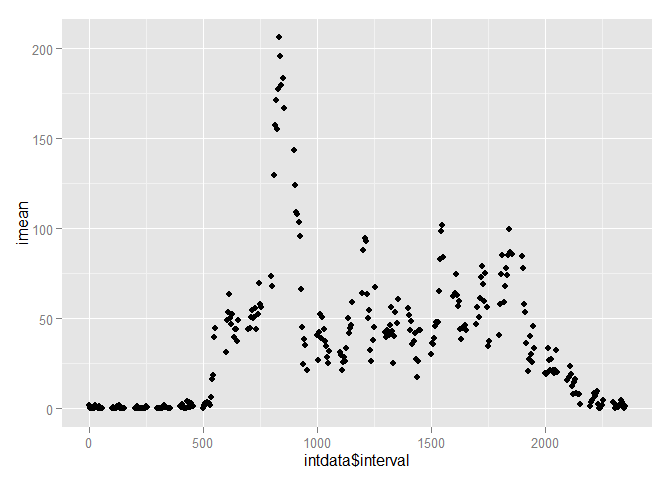
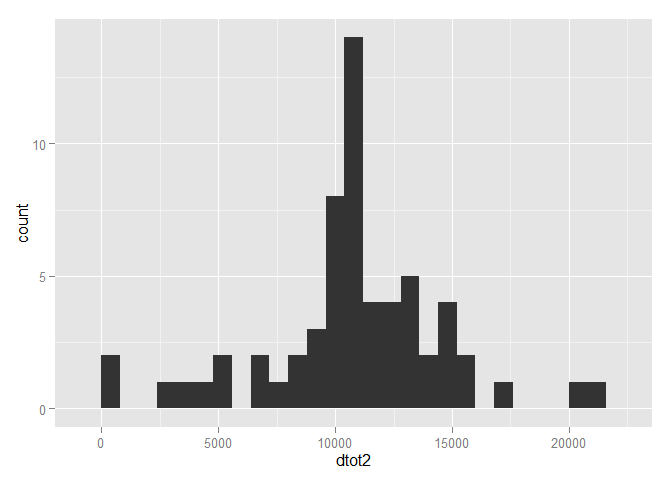
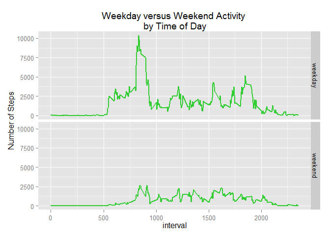

# Reproducible Research: Peer Assessment 1

```r
  options(warn=-1)
  library(ggplot2)
  library(plyr)
  options(warn=0)
```

## Loading and preprocessing the data


```r
  setwd("C:/Users/elarsen/Coursera work")
  data<-read.csv("reproducible research/activity.csv")
  
  ##get the set of dates and intervals measured
  
  dates<-unique(data[,2])
  intervals<-unique(data[,3]) 
  
  ## Calculated totals by day and make a tidy table
  dtot<-tapply(data$steps,data$date,sum)
  dmean<-tapply(data$steps,data$date,mean, na.rm=TRUE)
  dmedian<-tapply(data$steps,data$date,median, na.rm=TRUE)
  dailydata<-data.frame(dates, dtot, dmean, dmedian, na.rm=TRUE)
```

 


## What is mean total number of steps taken per day?

```
## Warning in `$.data.frame`(intdata, interval): Name partially matched in
## data frame
```

```
## Warning in `$.data.frame`(intdata, interval): Name partially matched in
## data frame
```

 


```
## [1] 835
```

xdata<-xtabs(steps~date + interval, data=data)


## What is the average daily activity pattern?

 

```
## Median   Mean 
##  37.38  37.38
```

```
## Median   Mean 
##  37.38  37.38
```

 


